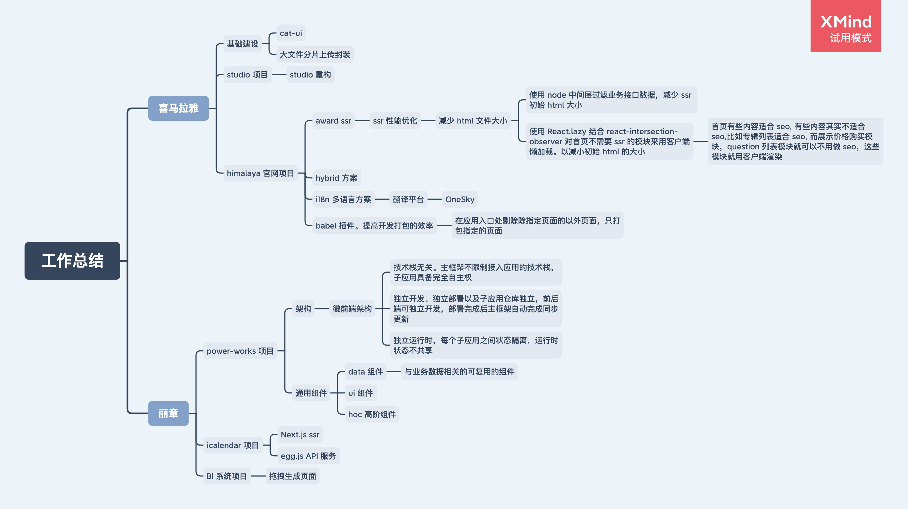

# 技术工作总结

## 0. 工具站收集

- [caniuse](https://caniuse.com/):查看特性的兼容性
- [Lighthouse](https://developers.google.com/web/tools/lighthouse/?utm_source=devtools):Chrome 自带工具，用来测试网站的性能、可访问性和用户体验。

## 1. 技术总结

### 前端开发

- [前端跨域解决方案](./技术/前端开发/前端跨域解决方案.md)
- [前端性能优化](./技术/前端开发/前端性能优化/README.md)
- [XSS 攻击](./技术/前端开发/前端安全/XSS攻击.md)
- [CSRF 攻击](./技术/前端开发/前端安全/CSRF攻击.md)

### [JavaScript](./技术/JavaScript/README.md)

- [原型和原型链](./技术/JavaScript/原型和原型链.md)
- [JS 继承](./技术/JavaScript/JS继承.md)
- [JS 常见函数的实现](./技术/JavaScript/JS常见函数的实现.md)
- [JS 模块化](./技术/JavaScript/JS模块化.md)
- [JS 中浮点数精度问题](./技术/JavaScript/JS中浮点数精度问题.md)
- [EventLoop](./技术/JavaScript/EventLoop.md)

### React

- [React 相关的知识](./技术/React/README.md)

### Webpack

- [Webpack 性能优化](./技术/Webpack/Webpack性能优化.md)

### CSS

- [CSS](./技术/CSS/CSS.md)

### HTTP

- [HTTP](./技术/HTTP/HTTP.md)
- [HTTP 缓存](./技术/HTTP/HTTP缓存.md)
- [HTTPS](./技术/HTTP/HTTPS.md)
- [HTTP2](./技术/HTTP/HTTP2.md)

## 工作总结

### 丽章

- [power-works 项目（ToB）](./丽章/power-works项目.md)

### 喜马拉雅

- 基础建设

  - [UI 组件库](./喜马拉雅/基础建设/UI组件库.md)
  - [文件分片上传封装](./喜马拉雅/基础建设/文件分片上传封装.md)

- himalaya 官网项目（**ToC**）

  - [Hybrid 原理](./喜马拉雅/himalaya官网项目/Hybrid原理.md)
  - [i18n 国际化](./喜马拉雅/himalaya官网项目/i18n国际化.md)
  - [ReactSSR](./喜马拉雅/himalaya官网项目/ReactSSR.md)
  - [Babel 插件](./喜马拉雅/himalaya官网项目/babel插件.md)

- studio 项目（**ToC**）
