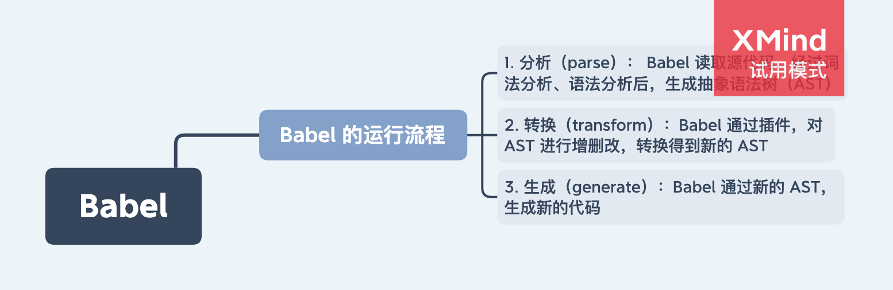

# babel 插件

## 1. 开发中存在的问题

在 award 中，有一个 RootPage/index.js 文件，其作用是导入根页面（RootPage）和所有的子页面（subPages）。

随着项目的开发，新的页面越来越多，由于 award 没有实现类似于 Next.js “懒编译” 的功能，所以运行 `npm run dev` 启动开发环境的时间也越来越长，非常的影响开发效率。

针对这一个问题，可以通过 `只导入需要开发的子页面` 和 `只导出需要开发的子页面` 来解决。但如果每次开发，都手动修改 RootPage/index.js 文件的话，会很繁琐。所以我写了一个 Babel 插件来做这件事情。配合 npm scripts，可以实现在运行一个命令实现类似 “懒编译” 启动开发环境的功能。

## 2. Babel 插件的实现

### 2.1 分析需要对哪些节点进行操作（删除）

首先看一下 RootPage/index.js 的源码：

```js
import Award from '@xmly/award';
import Page from './Page';
import HomePage from '../HomePage';
import AboutPage from '../AboutPage';
// 更多的页面导入已省略
// 其他代码已省略

const subPages = {
  HomePage,
  AboutPage,
};

export default Award.load({
  Page,
  subPages,
});
```

可以看到，我们主要是要对以下节点进行删除：

1. 文件顶部的导入声明的节点
2. subPages 对象下的的属性节点

### 2.2 插件参数设计

因为我们需要只编译开发的页面，所以我们设计传给 Babel 插件的参数为 `reservedPages` 属性：它表示需要保留（编译）的页面

### 2.3 插件的开发

```js
const fs = require('fs');

// 需要保留的模块（禁止插件移除的模块）
const disableRmoveModules = ['@xmly/award', 'Page', 'RouteHook', 'subPages'];

module.exports = function ({ types: babelTypes }) {
  return {
    // 插件名称
    name: 'select-page-babel-plugin',
    // 定义 visitor 对象，使用访问者模式访问 AST 节点
    visitor: {
      // 当访问到了 import 声明的节点时会执行该方法
      ImportDeclaration(path, state) {
        // 取得传入插件的参数 reservedPages
        const { reservedPages } = state.opts;
        // reservedPages 为空数组时，表示不删除节点
        if (!reservedPages.length) {
          return;
        }
        // 取到模块的名称
        const value = path.node.source.value.replace(/^\.*\/*/, '');
        // 将需要保留的模块和传入插件的参数 reservedPages 合并，得到不能移除的模块名称数组
        const _disableRmoveModules = [...disableRmoveModules, ...reservedPages];
        // 如果当前模块存在于该数组中时，不删除节点
        if (_disableRmoveModules.includes(value)) {
          return;
        }
        // 删除节点
        path.remove();
      },
      // 当访问到了对象属性时会执行该方法
      Property(path, state) {
        // 取得传入插件的参数 reservedPages
        const { reservedPages } = state.opts;
        // 将需要保留的模块和传入插件的参数 reservedPages 合并，得到不能移除的模块名称数组
        const _disableRmoveModules = [...disableRmoveModules, ...reservedPages];
        // 得到属性名称
        const value = path.node.key.name;
        // 如果当前属性名称存在于该数组中时，不删除节点
        if (_disableRmoveModules.includes(value)) {
          return;
        }
        // 删除节点
        path.remove();
      },
    },
  };
};
```

这样，一个 Babel 插件就开发好了。然后我们结合 npm scripts 来实现一个命令修改 `RootPage/index.js`，只保留需要编译页面的导入和导出：

```js
// pageSelect.js
const babel = require('@babel/core');
const fs = require('fs');
const path = require('path');
const chalk = require('chalk');
const inquirer = require('inquirer');

const log = console.log;
const pagesDir = path.join(__dirname, '../../', './pages/');
const rootPageDir = path.join(pagesDir, './RootPage/');
const sourceFilePath = path.join(rootPageDir, './index.js');
const ignorePages = ['RootPage', '.DS_Store'];

main();

async function main() {
  const hmlyWebPages = getAllPage();
  const selectedPages = await selectPages(hmlyWebPages);

  if (!selectedPages.length) {
    log(chalk.red('请选择至少一个页面进行开发！'));
    process.exit(1);
  }

  const code = fs.readFileSync(sourceFilePath, {
    encoding: 'utf8',
  });

  babel.transform(
    code,
    {
      plugins: [
        [
          './scripts/build/select-page-babel-plugin',
          {
            reservedPages: selectedPages,
          },
        ],
      ],
    },
    function (err, result) {
      if (err) {
        log(chalk.red(err));
        process.exit(1);
      }
      const code = result.code;
      fs.writeFileSync(sourceFilePath, code);
    }
  );
}

// 获取 hmly-web 中所有的页面
function getAllPage() {
  return fs.readdirSync(pagesDir).filter((name) => !ignorePages.includes(name));
}

// 选择一个页面
async function selectPages(pages) {
  const questionOne = {
    type: 'checkbox',
    name: '_pages',
    message: '您要开发哪个页面？',
    choices: pages,
  };
  const { _pages } = await inquirer.prompt(questionOne);
  return _pages;
}
```

然后在 `package.json` 中添加：

```json
{
  "scripts": {
    "page": "node scripts/build/pageSelect.js && npm run dev",
    "page-reset": "git checkout ./pages/RootPage/index.js"
  }
}
```

- 运行 `npm run page` 可以让开发者选择页面，选择完页面后，babel 调用写好的插件，转换 `RootPage/index.js` 文件然后启动开发。
- 运行 `npm run page-reset` 可以将修改的 `RootPage/index.js` 还原。

## 3. 插件开发文档

#### 3.1 插件配置、开发官方文档：

- https://github.com/jamiebuilds/babel-handbook/blob/master/translations/zh-Hans/README.md

#### 3.2 其他文档：

- https://juejin.cn/post/6844903956905197576


