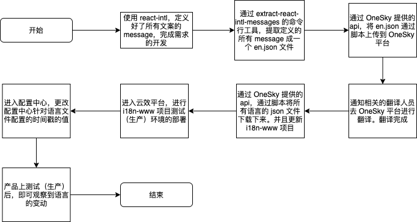

# i18n 国际化

himalaya 官网的国际化是分为两个项目：

1. hmly-web：himalaya 官网项目
2. i18n-www：存储 himalaya 官网项目和 studio 项目的翻译文件

hmly-web 会在应用最开始加载的时候，会根据用户选择的语言，去请求部署好的 i18n-www 项目的 json 文件。将请求得到的语言 json 作为参数传入 react-intl 的 IntlProvider 组件（包裹在组件树的最外层）中，即可完成网站的国际化。

## 一、使用的技术栈

- react-intl：用于定义 message，message 由 key 和 value 组成。因为 himalaya 的基础语言是英语，所以 value 是英语文案
- extract-react-intl-messages：提取定义的 message，生成 json 文件。生成的 json 文件可以上传到 OneSky 平台，让相关的翻译人员进行多语言的翻译

## 二、从需求到上线的国际化流程

