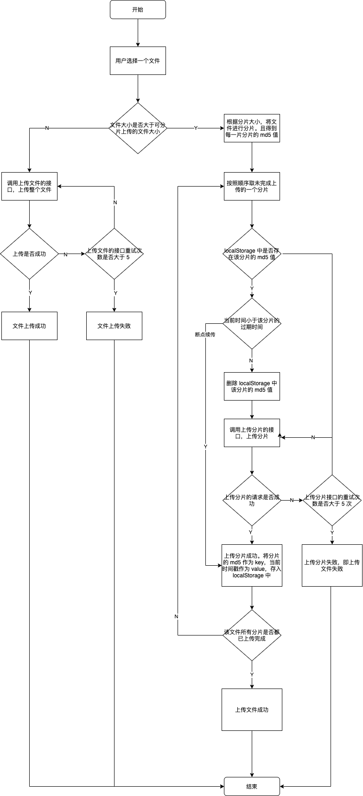

# 文件分片上传封装

## 一、文件上传遇到的问题

大文件上传时间长，用户反映上传大文件经常会失败

## 二、解决方案

1. 前端将文件进行分片，每次上传只上传某一片（或多片）文件
2. 某一片上传失败时，会对该分片进行多次重试，直到重试次数用户，才会提醒用户上传失败
3. 上传失败后，用户可以重试上传。重试会从上传失败的分片开始，进行断点续传

总结一下，就是要实现以下功能：

- 分片上传
- 错误重试
- 断点续传

## 三、方案的实现

### 3.1 上传的流程图



### 3.2 技术实现

#### 3.2.1 API 的设计

1. 可以封装一个 Webuploader 类，用于创建上传文件的实例。Webuploader 的构造函数接受一个 uploadOptions 的对象参数，该对象参数有以下属性：

```typescript
import { Canceler } from 'axios';

export interface UploadOptions {
  /**
   * input dom
   */
  dom: HTMLInputElement | HTMLInputElement[];
  /**
   * 是否可以选择多个文件
   * 默认值：false
   */
  multiple?: boolean;
  /**
   * 上传文件的地址
   */
  url: string;
  /**
   * 上传分片的地址（若不指定，则使用 url 作为分片上传的地址）
   */
  uploadChunkUrl?: string;
  // ...其他属性配置省略
  /**
   * 有新的文件被加入队列时的回调
   * filesInfo：被加入到队列的文件信息
   */
  onFilesInfoQueued?: (filesInfo: FileInfo[]) => void;
  /**
   * 文件数量改变、文件状态改变时的回调
   * allFileInfo：所有上传的文件信息
   * statusChangedFileInfo：状态发生的文件信息
   */
  onChange?: (
    allFileInfo: FileInfo[],
    statusChangedFileInfo?: FileInfo
  ) => void;
  /**
   * 上传前的回调，此回调用来对文件进行 md5 序列化、验证等操作
   * fileInfo：文件信息
   * callback：回调函数。当传入 errorMessage 参数，表示有错误，该文件不进行上传；否则进行上传
   */
  onBefore?: (
    fileInfo: FileInfo,
    callback: (errorMessage?: string) => void
  ) => void;
  /**
   * 开始上传的回调
   * fileInfo：文件信息
   */
  onStart?: (fileInfo: FileInfo) => void;
  /**
   * 文件是否上传成功的验证回调（可使用此回调对服务端返回的数据进行验证，看是否真的上传成功了）
   * fileInfo：文件信息
   * res：服务端响应的数据
   * callback：回调函数。当传入 errorMessage 参数，表示有错误，该文件上传是否；否则文件上传成功
   */
  onSuccessVerify?: (
    fileInfo: FileInfo,
    res: unknown,
    callback: (errorMesssage?: string) => void
  ) => void;
  /**
   * 上传成功的回调
   * fileInfo：文件信息
   * res：服务端响应的数据
   */
  onSuccess?: (fileInfo: FileInfo, res?: unknown) => void;
  /**
   * 上传失败的回调
   * error：错误信息
   * info：上传失败的文件（分片）信息
   */
  onError?: (error: Error, info: Info) => void;
  // ...其他的回调省略
```

- 其中不只包含了 `dom`、`multiple`、`url` 等一些属性，还包含了 `onFilesInfoQueued`、`onSuccess` 等一些回调。在合适的回调函数中，我们可以自定义一些我们的业务逻辑

2. 在创建 uploader 实例对象之后，我们在实例对象上也需要一些方法来进行调用。根据实际使用场景，我们设计了以下实例方法：

```typescript
/**
 * 添加对 input change 事件的监听（当你想用另外一个 file input 选择文件且不想创建新实例时使用。此时新的 file input 选择的文件也处于原来的文件列表中）
 */
uploader.addInputDOM: (HTMLInputElement | HTMLInputElement[]) => void;

/**
 * 获取文件统计信息
 */
uploader.getStats: () => any;

/**
 * 清除文件统计数据
 */
uploader.clearStats: () => any;

/**
 * 将一个文件（分片）设置为成功上传的状态
 * id：文件（分片）的 id
 */
uploader.toSuccessful: (id: string) => void;

/**
 * 通过 id 移除一个文件。移除成功返回 true，移除失败返回 false
 * id：文件的 id
 */
uploader.remove: (id: string) => boolean;

/**
 * 对一个文件（分片）进行重试上传。返回值为 true 时，表示正在重试；否则表示没有重试次数了，不进行重试
 * id：文件（分片）的 id
 */
uploader.retry: (id: string) => boolean;

/**
 * 移除对 input change 事件的监听
 * 注意：在第二次（包含第二次）之后对同一个 input 实例化时，需要先调用方法
 */
uploader.removeEventListener: () => void;
```

3. 由于实际使用场景中，可能我们的项目有自己封装的 http 请求。所以我们还封装了适配器：用户可以基于已有的项目进行 http 适配器的封装；也可以使用我们提供的默认 `axios适配器`：

```typescript
// 导出 axiosAdapterFactory 适配器工厂函数
import { Webuploader, axiosAdapterFactory } from '@hife/uploader';

// 通过类的 cnfigure 静态方法，配置全局的 requestAdapter。配置完之后，在进行文件（分片）上传时，会使用到该适配器
Webuploader.configure({
  requestAdapter: axiosAdapterFactory({
    withCredentials: true,
  }),
});

export default Webuploader;
```

- 这样，一个文件分片上传库的 API 设计就设计好了！

## 四、源码

https://github.com/hileix/uploader-1
