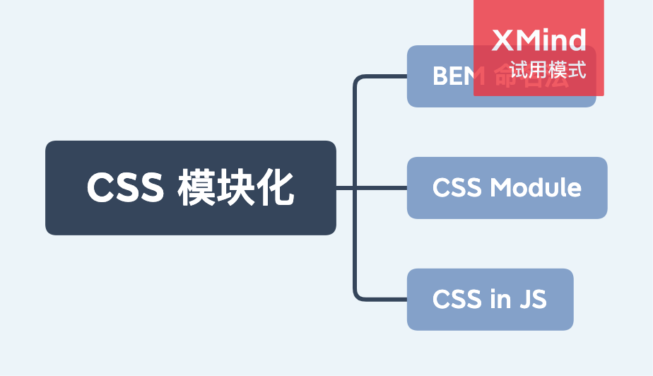

# CSS 模块化

- [BEM 命名法](./BEM命名法.md)
- CSS Module
- CSS in JS

模块化优点：

- 避免 `全局样式冲突`
- 更高的 `复用性`
- 更高的 `可维护性`

## 1. BEM 命名法

见 [BEM 命名法](./BEM命名法.md)

## 2. CSS Module

http://www.ruanyifeng.com/blog/2016/06/css_modules.html

## 3. CSS in JS

styles-component
