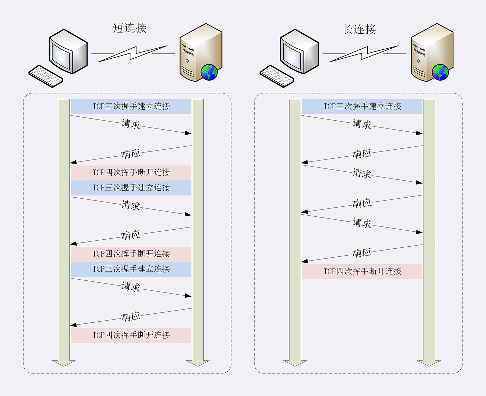
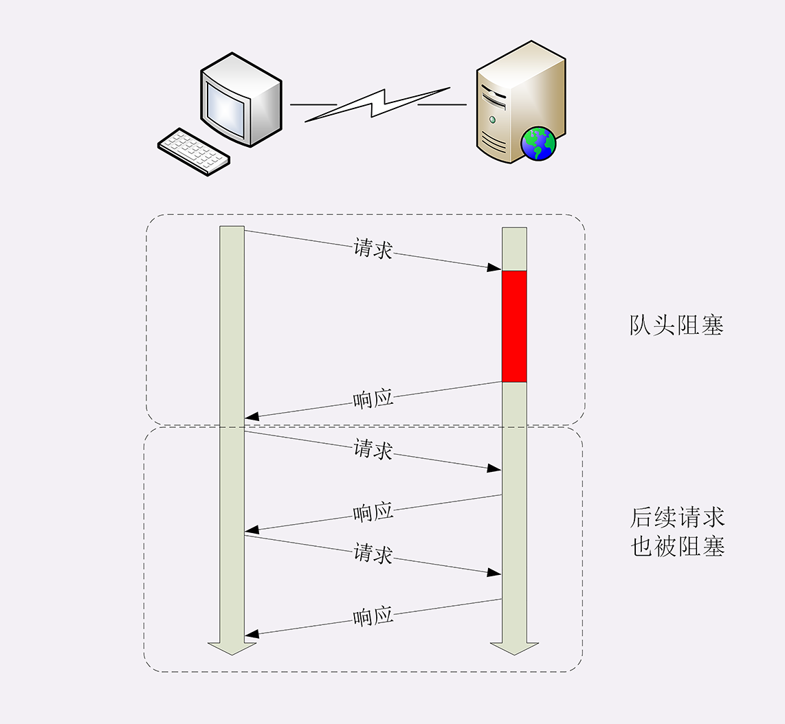

# HTTP

## 1. 什么是 HTTP？

HTTP（超文本传输协议）= 超文本＋传输＋协议。

HTTP 是一种传输音乐、视频、HTML 等超文本的协议。

## 2. HTTP 短连接

HTTP 协议最初（0.9/1.0）是个非常简单的协议，通信过程也采用了简单的“请求 - 应答”方式。

每次发送请求前，都需要先与服务器建立连接，收到响应报文后会立即关闭连接。这就是短连接。

### 2.1 短连接的缺点

因为建立连接和关闭连接都是非常昂贵的操作，所以每次发送请求都需要经历**建立连接**和**关闭连接**，传输效率低。

那有没有办法解决短连接所带来的问题呢？通过 HTTP 长连接。

## 3. HTTP 长连接

将 TCP 的连接和关闭均摊到多个 “请求-应答” 上去。这就是 HTTP 长连接。

### 3.1 启用长连接

在 HTTP/1.1 中连接默认启用长连接。

也可以在请求头中指定 Connection 的值为 keep-alive，来告诉服务器使用长连接。服务器会在响应头中放一个 Connection: keep-live 告诉客户端：“我是支持长连接的，接下来就用这个 TCP 一直收发数据”。

### 3.2 关闭长连接

如果 TCP 连接长时间不关，服务器必须在内存里保存它的状态，就这占用了服务器的资源。如果有大量的空闲长连接只连不发，就会很快耗尽服务器的资源，导致服务器无法为真正有需要的用户提供服务。

所以长连接需要在恰当的时间关闭。

- 客户端关闭长连接：在请求头里加上“Connection: close”字段，告诉服务器：“这次通信后就关闭连接”。

- 服务端关闭长连接：服务端一般不主动关闭连接。一般在代理服务器上做，如 Nginx：

1. 使用 "keepalive_time" 指令，设置长连接的超时时间，如果在一段时间内连接上没有任何数据收发就主动断开长连接。
2. 使用“keepalive_requests”指令，设置长连接上可发送的最大请求次数，在请求次数到达后会主动断开长连接。

## 4. 队头阻塞

因为 HTTP 规定报文必须是“一发一收”，这就形成了一个先进先出的“串行”队列。队列里的请求没有轻重缓急的优先级，只有入队的先后顺序，排在最前面的请求被最优先处理。

如果队首的请求因为处理的太慢耽误了时间，那么队列里后面的所有请求也不得不跟着一起等待，结果就是其他的请求承担了不应有的时间成本。

这就是队头阻塞。队头阻塞与短连接和长连接无关，是由 HTTP 基本的 “请求-应答” 模型所导致的。

### 4.1 队头阻塞的性能优化

- 并发连接：多开几个长连接。浏览器一般为 6 ~ 8 个。
- 域名分片：浏览器限制了同域名的并发的连接数量，可以多开几个域名。一个域名可以开 6 ~ 8 个长连接，多个域名就可以开更多的长连接了。
