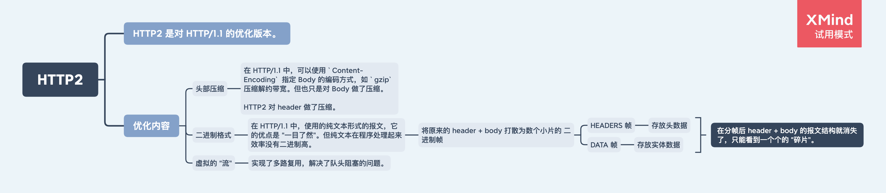
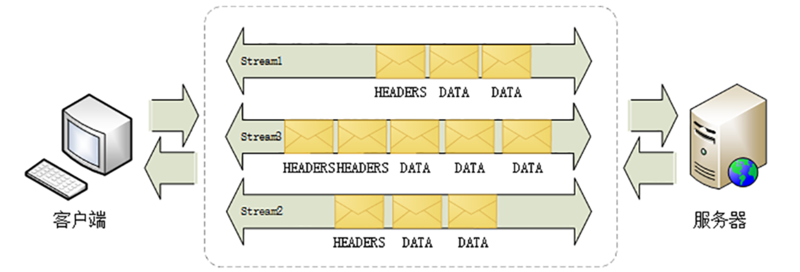
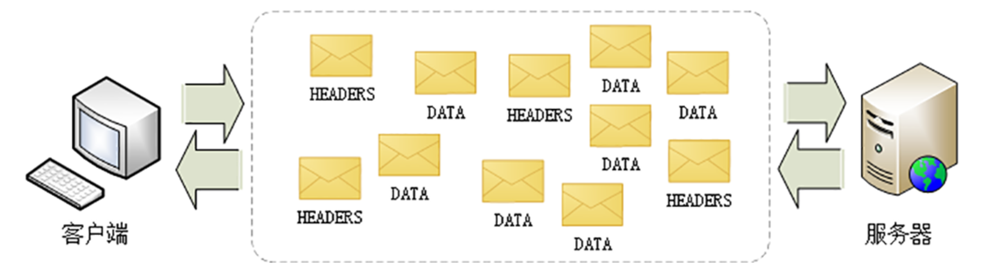

# HTTP2

HTTP2 是对 HTTP/1.1 的优化版本，是兼容 HTTP/1.1 版本的。



## 1. 头部压缩

在 HTTP/1.1 中，可以使用 `Content-Encoding` 指定 Body 的编码方式，如 `gzip` 压缩解约带宽。但也只是对 Body 做了压缩。

在 HTTP2 中，使用了 `“HPACK”` 算法对 Header 做了压缩。

## 2. 使用二进制格式

在 HTTP/1.1 中，使用的是纯文本形式的报文，它的有点是 “一目了然”，可读性高。

但使用纯文本的时候容易出现多义性，比如大小写、空白字符、回车换行、多字少字等等，程序在处理时必须用复杂的状态机，效率低。

使用二进制格式就没有这样的问题，效率更高。

## 3. 多路复用

在 HTTP/1.1 中，存在 `队头阻塞` 的性能问题，通过 `并发连接` 和 `域名分片` 可以解决部分性能问题，但不能从根本上解决。

所以在 HTTP2 中解决了 HTTP 的 `队头阻塞` 问题。（但实际在 TCP 层还是存在队头阻塞的问题，这个在 [HTTP3](./HTTP3) 中得到了解决）。

**多个往返通信都复用一个连接来处理。**

### 3.1 二进制帧

在 HTTP2 中，会将 Header 和 Body “切成” 数个小片的 `二进制帧`（Frame）：

- 用 `HEADERS` 帧存放 Header 数据
- 用 `DATA` 帧存放 Body 数据


### 3.2 二进制帧的传输：流

在 HTTP2 中定义了 `流` 的概念：它是二进制帧的双向传输序列，同一个消息往返的帧会分配一个唯一的流 ID。`流` 是虚拟的，并不存在。

在 `流` 的层面来看，`二进制帧` 收发是有序的：



实际在连接层面，`二进制帧` 收发是无序的：



多个请求-响应之间没有了顺序关系，不需要排队等待，也就没有了 “队头阻塞” 的问题。多路复用可以让带宽

#### 3.2.1 流的特点

- 流是可并发的，一个 HTTP/2 连接上可以同时发出多个流传输数据，也就是并发多请求，实现“多路复用”；
- 客户端和服务器都可以创建流，双方互不干扰；
- 流是双向的，一个流里面客户端和服务器都可以发送或接收数据帧，也就是一个“请求 - 应答”来回；
- 流之间没有固定关系，彼此独立，但流内部的帧是有严格顺序的；
- 流可以设置优先级，让服务器优先处理，比如先传 HTML/CSS，后传图片，优化用户体验；
- 流 ID 不能重用，只能顺序递增，客户端发起的 ID 是奇数，服务器端发起的 ID 是偶数；
- 在流上发送“RST_STREAM”帧可以随时终止流，取消接收或发送；
- 第 0 号流比较特殊，不能关闭，也不能发送数据帧，只能发送控制帧，用于流量控制。

### 3.3 为什么在 HTTP/1.1 中的雪碧图以及域名分片的优化在 HTTP2 中会造成反效果？

多路复用实现了请求的并发，所以以下在 HTTP/1.1 做的优化就没有必要了：

1. 雪碧图、内联资源（本质是减少请求数量）

- 请求速度：数据量相同的情况下，单个单文件的请求速度比多个小文件的请求速度更慢。
- 缓存：如果以后雪碧图的资源变了，牵一发而动全身，整个图片的缓存都没了，不能充分利用 HTTP 的缓存。

2. 域名分片

- 域名分片在 HTTP/1.1 中是为了突破浏览器同域名下同时的连接数。但这个问题在 HTTP2 中通过多路复用解决了。域名分片会增加连接成本，浪费资源。

## 4. HTTP2 的缺点

在弱网环境下，因为 HTTP2 只有一个连接，TCP 也存在队头阻塞，会导致其性能不如 HTTP/1.1。

## 5. 协议栈


在 HTTPS 协议栈的基础上，添加了：

- HPACK 算法压缩 Header
- Stream 实现多路复用

## 6. Nginx 开启 HTTPS

在 `ssl` 后面加上 http2。

```
server {
    listen 443 ssl http2;
    # 其他配置
    ....
}
```

## 参考

https://time.geekbang.org/column/article/112036
