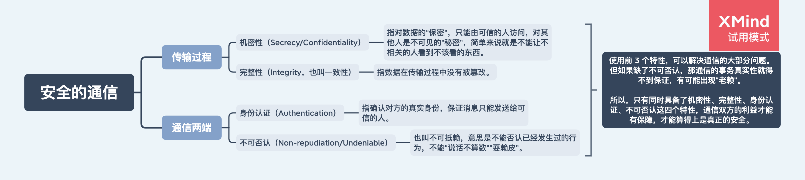

# HTTPS

## 1. 什么是 HTTPS？

**HTTPS = HTTP + SSL/TLS（安全套接层）。**

HTTPS 默认端口号为 443，传输的是加密的数据。

## 2. 为什么要有 HTTPS？

因为 HTTP 是不安全的（明文传输）。HTTP 加上 SSL/TLS（安全套接层）后，能够保证数据传入的安全性。

## 3. 什么是安全的通信？

## 4. 安全的通信

- [机密性](./安全的通信/机密性.md)
- [完整性](./安全的通信/完整性.md)
- [数字签名](./安全的通信/数字签名.md)
- [数字证书和 CA](./安全的通信/数字证书和CA.md)

## 5. 安全的通信总结

- 机密性：靠 `混合加密` 解决。对称加密加密内容，非对称加密对称密钥。
- 完整性：靠 `摘要算法` 解决。
- 身份认证：靠 `数字证书` 解决。数字证书因为 CA 机构的信任变成一个完整信任链条，从而实现通过数字证书证明了对方真实身份，但注意身份真实也可能是挂羊头卖狗肉，是一个坏人，所以，有了 CRL、OCSP，还有终止信任。
- 不可否认：靠 `数字签名` 解决。内容摘要算法得到摘要，私钥加密摘要，对方使用对应公钥解密，得到摘要，再和自己得到的服务器提供的原文摘要对比，一致说明这个内容就是原服务器提供的，由证书说明了服务器的身份。

## 6. HTTPS 建立安全连接的流程

### 6.1 TLS1.2 连接过程

在简历 TLS 连接前，首先会经过[三次握手](./TCP三次握手四次挥手.md)与网站简历 TCP 连接。
