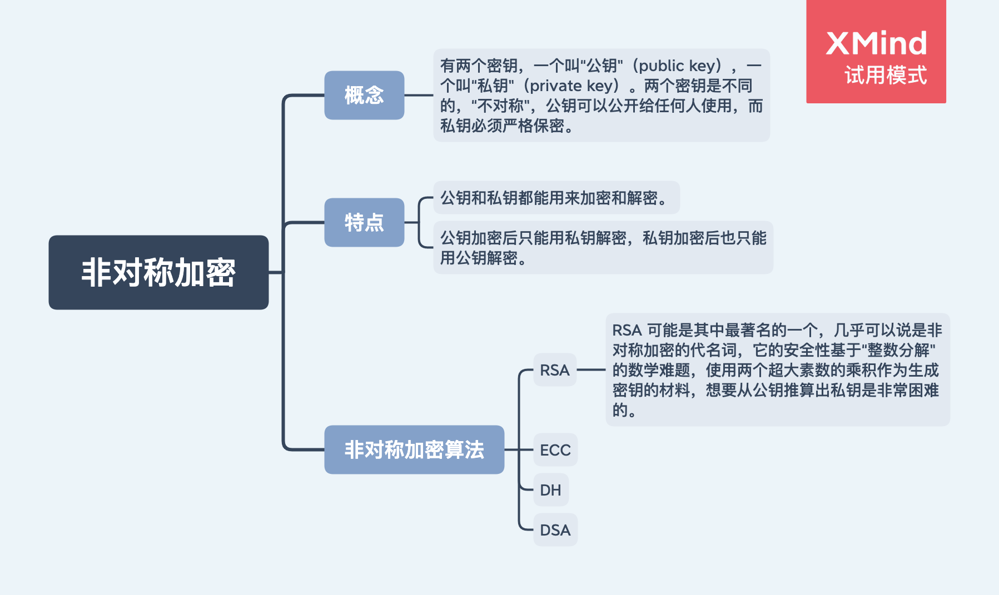

# 非对称加密（公钥加密算法）

## 对称加密传输流程

非对称加密可以很好的解决 “密钥交换” 问题。

## 存在的问题

虽然非对称加密没有 “密钥交换” 问题，但因为非对称加密算法都是基于复杂的数学难题，运算速度很慢，所以它在实际的实用性为 0。

如何解决呢？我们可以将对称加密和非对称加密两者的优点结合起来：既能高效的加密解密，又能安全地密钥交换。

在 TLS 中使用的就是 [混合加密](./混合加密.md)。
