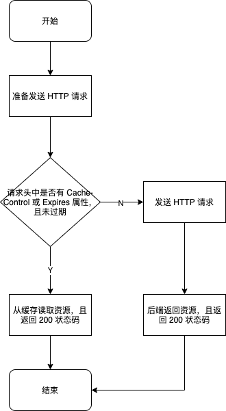
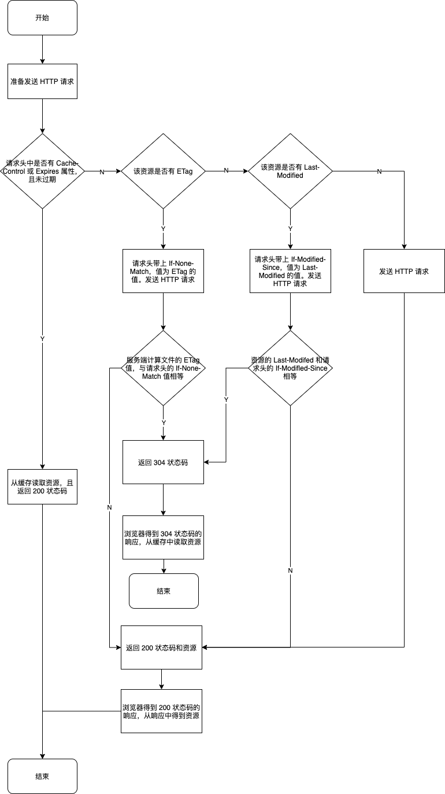

# HTTP 缓存

HTTP 缓存只能缓存 get 请求响应的资源。

根据是否需要向服务器发起请求来分类，可以分为两类：

- 强缓存：不需要向服务器发起请求，直接使用浏览器缓存的资源。
- 协商缓存：需要向服务器发起请求，如果返回 304，则浏览器会使用缓存的资源，否则使用返回的新资源。

## 1. 强缓存

### 1.1 是否使用强缓存看以下两个请求头属性：

- Cache-Control(HTTP/1.1)。其有以下属性值：

  - max-age:资源缓存的时间（单位秒），是相对时间。
  - no-store:资源不使用缓存。
  - public:资源可以被所用用户缓存，所有用户指：终端和 CDN 等中间代理服务器。
  - private:资源只能被终端浏览器缓存（而且是私有缓存），不允许中继缓存服务器进行缓存。

- Expires(HTTP/1.0+):其值为一个绝对时间，表示资源的过期时间。Expires 受限于本地时间，如果修改了本地时间，可能会造成缓存失效。

**Cache-Control 和 Expires 如果同时出现，Cache-Control 的优先级更高。**

### 1.2 强缓存流程

发送请求前，浏览器会先查看请求头是否有 Cache-Control 或 Expires 属性。
如果有且未过期，则直接从缓存中获取资源，且返回 200 的状态码；
否则向后端发送请求，后端返回资源且返回 200 的状态码。

强缓存流程图如下：

## 2. 协商缓存

### 2.1 是否使用协商缓存看以下请求头属性：

- ETag/If-None-Match(HTTP/1.1)

  - ETag:该属性在响应头中。值为通过算法（默认为 hash 算法）算出文件内容的 hash 值，资源内容变化了，ETag 也会变化。
  - If-None-Match:该属性在请求头中。值为上次响应返回的 ETag 值。

- Last-Modified/If-Modified-Since(HTTP/1.0)
  - Last-Modified:该属性在响应头中。值表示资源最后的修改日期。（如果在本地打开缓存文件，就会造成 Last-Modified 被修改，所以在 HTTP / 1.1 出现了 ETag）
  - If-Modified-Since:该属性在请求头中。值为上次响应返回的 Last-Modified 值。

**ETag/If-None-Match 的优先级比 Last-Modified/If-Modified-Since 更高**

### 2.2 协商缓存流程

## 参考

https://github.com/amandakelake/blog/issues/41

https://www.jianshu.com/p/227cee9c8d15
