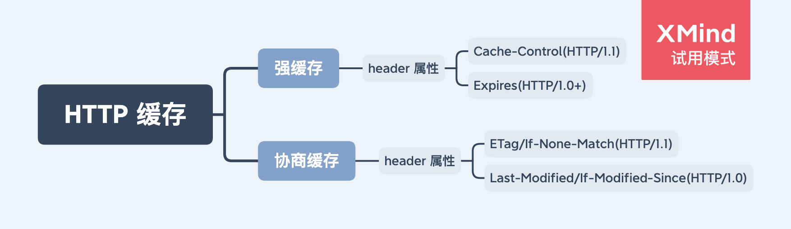

# HTTP 缓存

HTTP 缓存只能缓存 get 请求响应的资源。

根据是否需要向服务器发起请求来分类，可以分为两类：

- 强缓存：不需要向服务器发起请求，直接使用浏览器缓存的资源。
- 协商缓存：需要向服务器发起请求，如果返回 304，则浏览器会使用缓存的资源，否则使用返回的新资源。

未完...

## 参考

https://www.jianshu.com/p/227cee9c8d15
