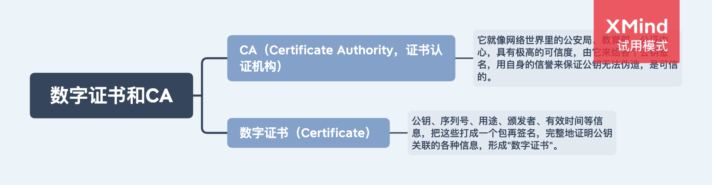

# 数字证书和 CA

还有一个“公钥的信任”问题。因为谁都可以发布公钥，我们还缺少防止黑客伪造公钥的手段，也就是说，怎么来判断这个公钥就是你或者某宝的公钥呢？

由专门的 CA 机构来颁发数字证书。

## 1. CA 如何证明自己呢？

小一点的 CA 可以让大 CA 签名认证，但链条的最后，也就是 Root CA，就只能自己证明自己了，这个就叫“自签名证书”（Self-Signed Certificate）或者“根证书”（Root Certificate）。你必须相信，否则整个证书信任链就走不下去了。

## 2. 证书体系的弱点

### 2.1 如果 CA 失误或者被欺骗，签发了错误的证书，虽然证书是真的，可它代表的网站却是假的，这个时候该怎么办？

开发出了 CRL（证书吊销列表，Certificate revocation list）和 OCSP（在线证书状态协议，Online Certificate Status Protocol），及时废止有问题的证书。

### 2.2 如何 CA 被黑客攻陷，或者 CA 有恶意，因为它（即根证书）是信任的源头，整个信任链里的所有证书也就都不可信了，这个时候该怎么办？

因为涉及的证书太多，就只能操作系统或者浏览器从根上“下狠手”了，撤销对 CA 的信任，列入“黑名单”，这样它颁发的所有证书就都会被认为是不安全的。
