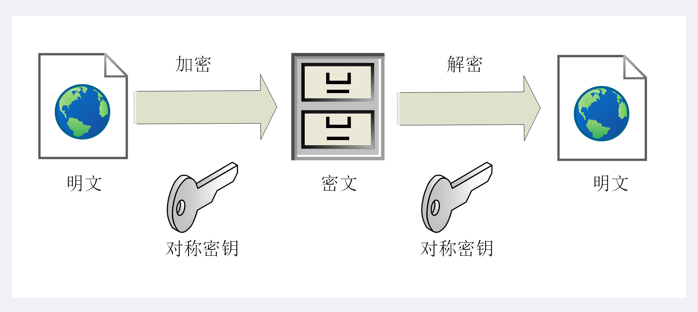

# 机密性

指对数据的“保密”，只能由可信的人访问，对其他人是不可见的“秘密”，简单来说就是不能让不相关的人看到不该看的东西。

## 1. 对称加密

### 1.1 对称加密传输流程

### 1.2 存在的问题

对称加密存在一个很大的问题：如何把密钥安全地传递给对方，术语叫 **“密钥交换”**。

因为在对称加密算法中只要持有密钥就可以解密。如果你和网站约定的密钥在传递途中被黑客窃取，那他就可以在之后随意解密收发的数据，通信过程也就没有机密性科研了。

如何解决呢？使用 **非对称加密算法（也叫公钥加密算法）**

## 2. 非对称加密算法（公钥加密算法）

### 2.1 非对称加密传输流程

非对称加密可以很好的解决 “密钥交换” 问题。

### 2.2 存在的问题

虽然非对称加密没有 “密钥交换” 问题，但因为非对称加密算法都是基于复杂的数学难题，运算速度很慢，所以它在实际的实用性为 0。

如何解决呢？我们可以将对称加密和非对称加密两者的优点结合起来：既能高效的加密解密，又能安全地密钥交换。

在 TLS 中使用的就是 **混合加密**。

## 3. 混合加密

混合加密就解决了对称加密算法的密钥交换问题，而且安全和性能兼顾，完美地实现了机密性。
