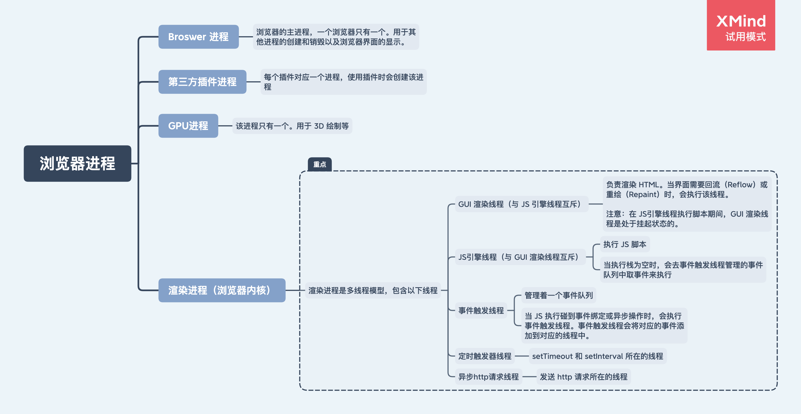
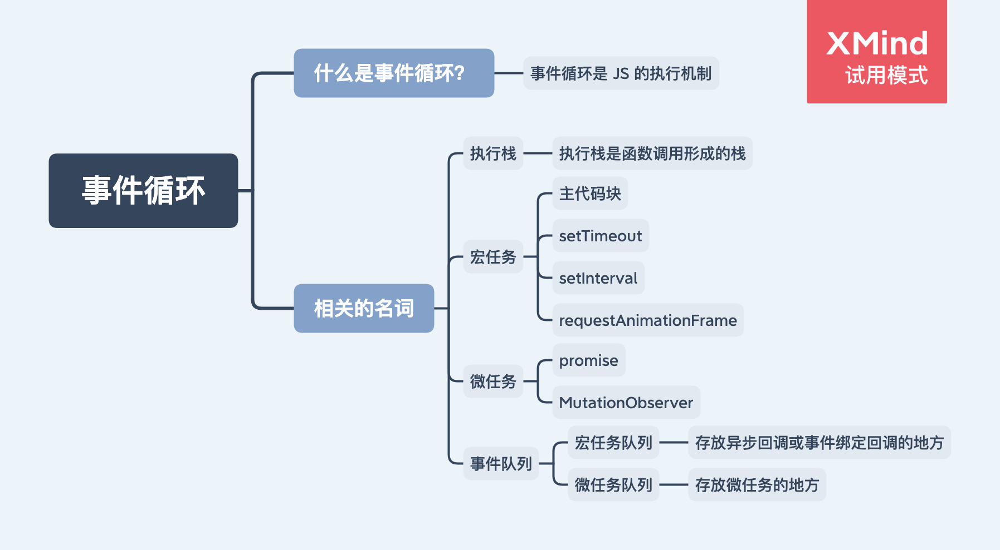

# EventLoop 事件循环

事件循环是 js 的执行机制。

## 1. 浏览器进程



在上图中，我们重点来看 **渲染进程（浏览器内核）**。

## 2. 渲染进程（浏览器内核）

渲染进程（浏览器内核）是多进程模型，包含了以下线程：

- GUI 渲染线程（与 JS 引擎线程互斥）

负责渲染 HTML。当界面需要回流（Reflow）或重绘（Repaint）时，会执行该线程。

> 注意：在 JS 引擎线程执行脚本期间，GUI 渲染线程是处于挂起状态的。

- JS 引擎线程（如：v8 引擎）

1. 执行 JS 脚本。
2. 当执行栈为空时，会去事件触发线程管理的事件队列中取事件来执行。

- 事件触发线程

1. 管理着一个事件队列。
2. 当 JS 执行碰到事件绑定或异步操作时，会执行事件触发线程：事件触发线程会将对应的事件添加到对应的线程中。

- 定时触发器线程

  setTimeout 和 setInterval 所在的线程。

- 异步 http 请求线程

  发送 http 请求所在的线程。

了解完上面这些线程的概念后，接下来讲讲事件循环。

## 3. 事件循环

事件循环是 js 的执行机制。


从上图中，可以看到当使用 WebAPIS 产生的 callback，会进入到 `事件队列（callback queue）` 中。

当执行完 `执行栈（stack）` 中的任务时，JS 引擎线程会去 `事件队列` 中查找是否有事件存在：如果存在，则将该事件放入 `执行栈` 中执行；否则持续监听 `事件队列` 中是否有事件需要执行。

JS 引擎线程清空 `执行栈`，然后从 `事件队列` 中拿事件继续清空 `执行栈` 这个反复的过程，称为 `事件循环`。

## 4. 事件队列



有两种类型的事件队列：

- 宏任务队列：存放宏任务的队列。以下会产生宏任务：

  - 主代码块
  - setTimeout
  - setInterval
  - requestAnimationFrame

- 微任务队列：存放微任务的队列。以下会产生微任务：

  - promise
  - MutationObserver

在细化了事件队列的类型后，事件循环的流程如下：

1. 执行 `执行栈` 中的任务，直到执行完（在执行任务时产生的 `宏任务` 和 `微任务` 会被添加 `宏任务队列` 和 `微任务队列` 中）。
2. 查看 `微任务队列` 中的任务，如果有，就执行完 `微任务队列` 中所有的任务。（在执行完 `微任务队列` 中所有的任务后，GUI 线程会进行界面的渲染，此时 JS 引擎线程会被冻结。渲染完后，会进入第三步）
3. 查看 `宏任务队列` 的任务，如果有，就取第一个任务放入 `执行栈`，再跳回第一步。

## 5. Node.js 中的事件循环

```
 ┌───────────────────────────┐
┌─>│           timers          │
│  └─────────────┬─────────────┘
│  ┌─────────────┴─────────────┐
│  │     pending callbacks     │
│  └─────────────┬─────────────┘
│  ┌─────────────┴─────────────┐
│  │       idle, prepare       │
│  └─────────────┬─────────────┘      ┌───────────────┐
│  ┌─────────────┴─────────────┐      │   incoming:   │
│  │           poll            │<─────┤  connections, │
│  └─────────────┬─────────────┘      │   data, etc.  │
│  ┌─────────────┴─────────────┐      └───────────────┘
│  │           check           │
│  └─────────────┬─────────────┘
│  ┌─────────────┴─────────────┐
└──┤      close callbacks      │
   └───────────────────────────┘
```

- timers（定时器）：本阶段执行已经被 setTimeout() 和 setInterval() 的调度回调函数。
- pending callbacks（待定回调）：执行延迟到下一个循环迭代的 I/O 回调。
- idle, prepare：仅系统内部使用。
- poll（轮询）：检索新的 I/O 事件;执行与 I/O 相关的回调（几乎所有情况下，除了关闭的回调函数，那些由计时器和 setImmediate() 调度的之外），其余情况 node 将在适当的时候在此阻塞。
- check（检测）：setImmediate() 回调函数在这里执行。
- close callbacks（关闭的回调函数）：一些关闭的回调函数，如：socket.on('close', ...)。

## 参考

- https://developer.mozilla.org/zh-CN/docs/Web/JavaScript/EventLoop
- https://juejin.cn/post/6844904050543034376
- https://zhuanlan.zhihu.com/p/33058983
- https://segmentfault.com/a/1190000022805523
- http://latentflip.com/loupe/
- https://juejin.cn/post/6844903512845860872
- https://zhuanlan.zhihu.com/p/33087629
