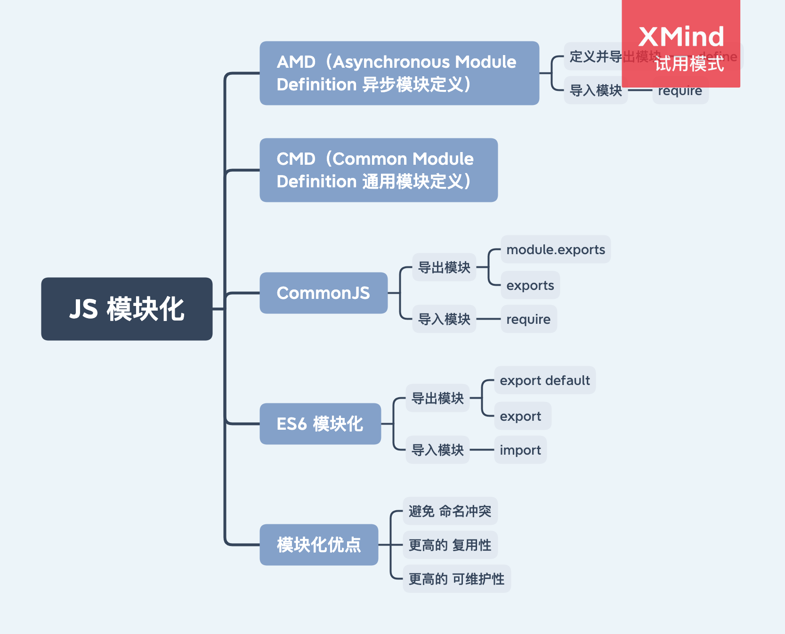

# JS 模块化



- CommonJS
- ES6 模块化
- AMD（Asynchronous Module Definition 异步模块定义）。require.js
- CMD（Common Module Definition 通用模块定义）。Sea.js

模块化的优点

- 避免 `命名冲突`
- 更高的 `复用性`
- 更高的 `可维护性`

## 1. CommonJS

- CommonJS 是在 Node.js 端的模块化方案

### 1.1 特点

- 每个文件是一个模块，所有代码都运行在模块作用域，不会污染全局作用域
- 模块的加载是运行时同步加载的
- 模块可以多次加载，但是只会在第一次加载时运行，然后运行结果就被缓存了。以后再加载，就直接读取缓存
- 模块加载的顺序，按照其在代码中出现的顺序

### 1.2 语法

- 导出模块：`module.exports = value;` 或 `exports.xxx = value;`
- 导入模块：`require(xxx);`。如果是第三方模块，xxx 为模块名；如果是自定义模块 xxx 为文件路径

## 2. ES6 模块化

ES6 模块的设计思想是尽量的静态化，使得编译时就能确定模块的依赖关系，以及输入和输出的变量。

### 2.1 语法

- 导出模块：https://developer.mozilla.org/zh-CN/docs/Web/JavaScript/Reference/Statements/export

1. 命名导出（每个模块包含任意数量）
2. 默认导出（每个模块包含一个）

- 导入模块：https://developer.mozilla.org/zh-CN/docs/Web/JavaScript/Reference/Statements/import

### 2.2 ES6 模块与 CommonJS 模块的差异

1. 导出：CommonJS 模块导出的是一个 `值的拷贝`，ES6 模块导出的是 `值的引用`。
2. 加载：CommonJS 模块是 `运行时加载`，ES6 模块是 `编译时加载`。

举个例子

在使用 CommonJS 时：

```js
let { stat, exists, readFile } = require('fs');
```

上面的代码首先会执行 fs 模块，得到一份值的拷贝，再获取对应的属性或方法。上面的代码等同于：

```js
let _fs = require('fs');
let stat = _fs.stat;
let exists = _fs.exists;
let readFile = _fs.readFile;
```

而在使用 ES6 模块时：

```js
import { readFile } from 'fs';
```

上面的 js 代码被 JavaScript 引擎编译时, 会将上面 fs 模块的属性 readFile 指向对应模块的 export const readFile 方法上。注意这里只是做了指针指向，而并不是执行 fs 模块。当执行 readFile() 时，就会去找指针指向的代码并执行。

## 3. AMD

用于浏览器。
Asynchronous Module Definition 异步模块定义。require.js 实现了该规范

AMD 的介绍：https://juejin.cn/post/6844903541853650951

## 4. CMD

用于浏览器。
Common Module Definition 通用模块定义。CMD 规范是国内发展出来的，Sea.js 实现了该规范。

CMD 的介绍：https://juejin.cn/post/6844903541853650951

# 参考

https://juejin.cn/post/6844903744518389768
