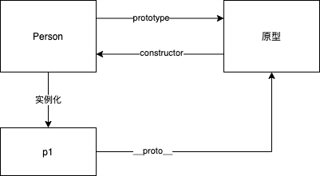
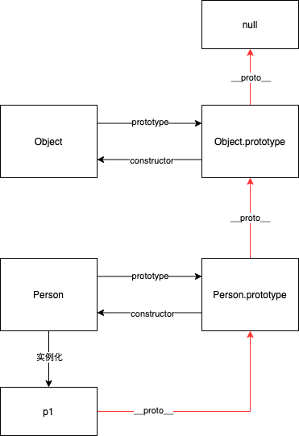

# 原型和原型链


## 1. 什么是原型？

原型是函数的 `prototype` 属性所指向的对象，或者说对象的 `__proto__` 属性指向的对象。

举个例子：

```js
// 定义一个构造函数
function Person(name, age) {
  this.name = name;
  this.age = age;
}

// 实例化一个对象
const p1 = new Person('xl', 18);

// Person 的 prototype 属性指向原型
console.log(Person.prototype); // { constructor: ƒ Person() }

// 原型的 constructor 指向构造函数 Person
console.log(Person.prototype.constructor === Person); // true

// p1 对象的 __proto__ 属性也指向原型
console.log(p1.__proto__); // { constructor: ƒ Person() }

console.log(Person.prototype === p1.__proto__); // true
```



## 2. 什么是原型链？

原型链是指相互关联（通过 `__proto__` 关联）的原型组成的链状结构。

在上面我们知道了什么是原型。原型是一个对象，那原型的 `__proto__` 属性又会指向谁呢？

```js
// 打印原型的原型
console.log(Person.prototype.__proto__); // { constructor: ƒ Object(), ...省略其他属性 }

console.log(Person.prototype.__proto__ === Object.prototype); // true

// 打印原型的原型的原型
console.log(Person.prototype.__proto__.__proto__); // null
```

从上面打印的结果来看：

- Person 原型的原型是 Object `prototype` 属性指向的原型
- Object 的原型是 null



红色的线就是原型链。从上图看，原型链是通过对象的 `__proto__` 属性关联起来的。
