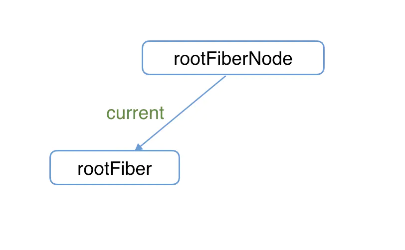
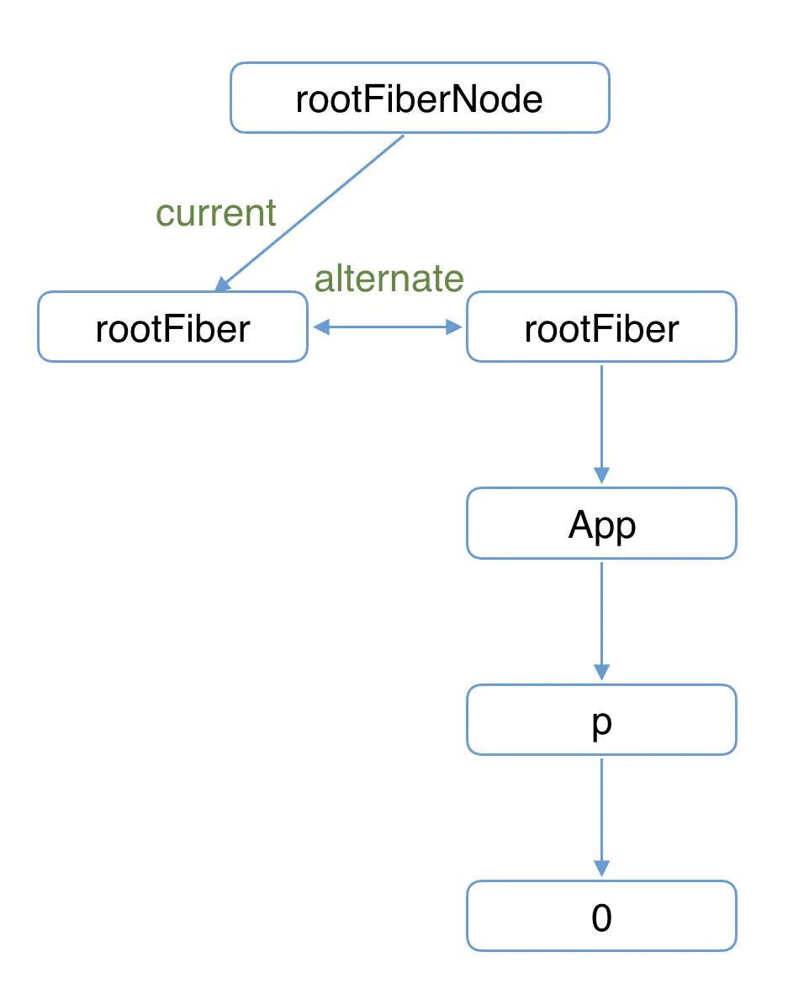
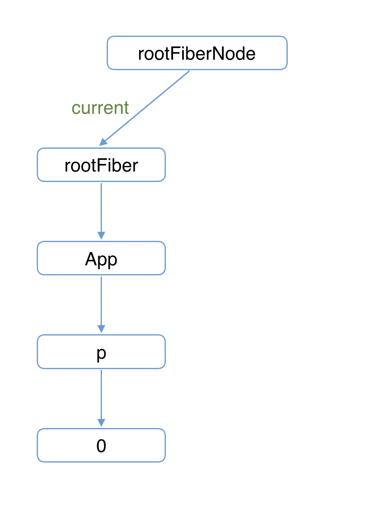
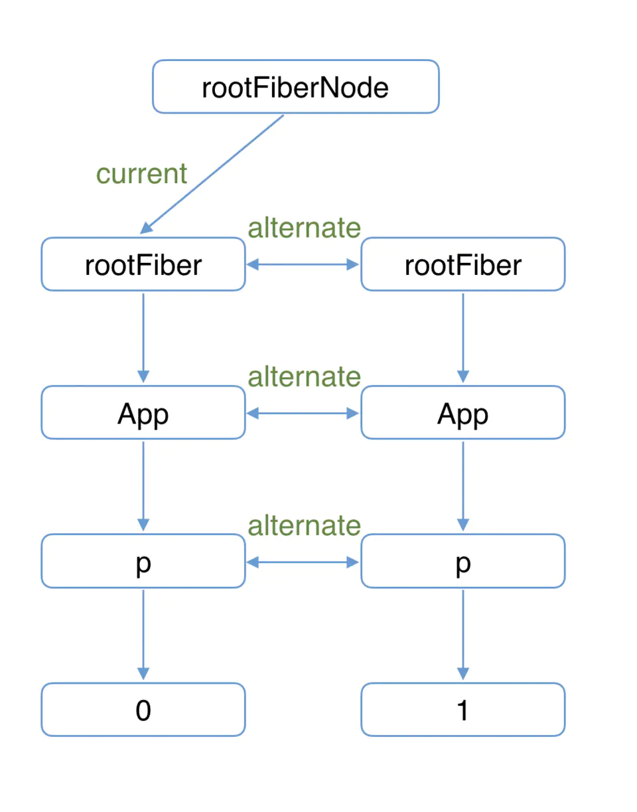
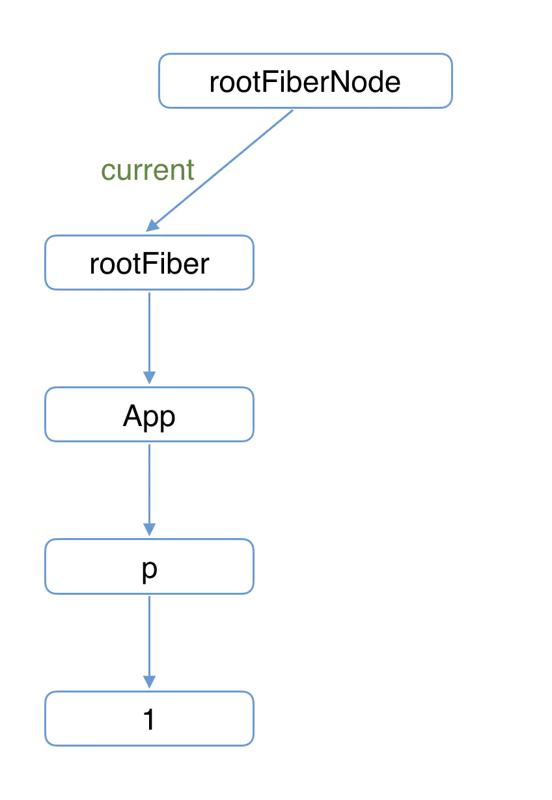

# React 的 Fiber

## 1. Fiber 的含义

1. 作为 `架构` 来说：

React15 的 Reconciler（协调器）采用递归的方式执行，被称为 Stack Reconciler。
React16 的 Reconciler（协调器）是基于 Fiber 节点来实现的，所以被称为 Fiber Reconciler。

2. 作为 `数据结构` 来说：

每个 Fiber 节点对应一个组件，保存了该组件的类型、对应 DOM 等信息。此时这个 Fiber 节点，就是我们所说的虚拟 DOM 节点。

3. 作为 `动态的工作单元` 来说：

Fiber 节点保存了组件需要更新的状态以及需要执行的副作用。

## 2. 双缓存

Fiber 架构使用一种被称为双缓存的工作机制。

### 2.1 什么是双缓存？

在绘制动画时，在绘制每一帧画面前，都会清除掉上一帧的画面。但如果当前帧的画面计算量比较大，就会导致清除上一帧到绘制当前帧之间有较长的时间，就会出现白屏闪烁的的问题。

如何解决呢？我们可以先直接在内存中计算当前帧，计算完整后将当前帧直接替换掉上一帧即可。

这种 `在内存中构建并直接替换的技术叫做双缓存`。

## 2.2 Fiber 架构如何使用双缓存的？

假如我们有这样一个组件需要渲染：

```jsx
function App() {
  const [count, setCount] = useState(0);
  return <p onClick={() => setCount(count + 1)}>{count}</p>;
}

ReactDOM.render(<App />, document.getElementById('root'));
```

### 2.2.1 首屏渲染时

1. 首次执行时
   首次执行 ReactDOM.render 时，会 `rootFiberNode` 和 `rootFiber` 节点。

- `rootFiberNode`:是整个应用的根节点。
- `rootFiber`:是 App 组件所在组件树的根节点。

为什么要区分 rootFiberNode 和 rootFiber？因为在应用中，我们可以调用多次 ReactDOM.render 来渲染不同的组件树，这些组件树都拥有自己的 rootFiber。

但整个应用只有一个 rootFiberNode 根节点。


2. 进入 `render phase`

此时会在内存中创建一颗 `workInProgress fiber 树`。两棵树使用 `alternate` 进行连接。



3. 进入 `commit phase`

完成 `commit phase` 后，DOM 会更新为 `workInProgress fiber 树` 对应的结构，并且 `rootFiberNode` 的 `current` 会指向 `workInProgress fiber 树` 的 `rootFiber` 根节点，使其变为 `current fiber 数`。



### 2.2.2 在点击 p 标签改变状态时

1. 进入 `render phase`

此时 React 会根据 `current fiber 树` 构建出 `workInProgress fiber 树`。

在该构建过程中，会用到 diff 算法。



2. 进入 `commit phase`

完成 `commit phase` 之后，DOM 会更新为 `workInProgress fiber 树` 对应的结构，并且 `rootFiberNode` 的 `current` 会指向 `workInProgress fiber 树` 的 `rootFiber` 根节点，使其变为 `current fiber 数`。


