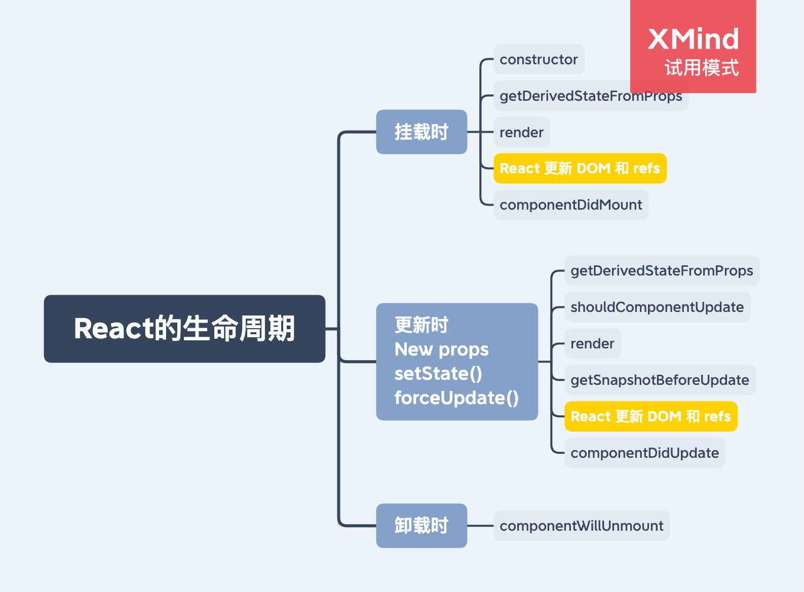

# React 的生命周期

React 生命周期：https://projects.wojtekmaj.pl/react-lifecycle-methods-diagram/

## 1. 还有一些生命周期在上面没有提到（在 React16 中被标记为不安全的生命周期，不推荐使用）

- componentWillMount:在 constructor 后执行。可以用来获取数据，但不推荐。
- componentWillReceiveProps:在 props 发生改变时，会立即执行。一般用来通过 props 改变本组件的 state。
- componentWillUpdate:在 render 之前执行。

### 1.1 废除了上面三个生命周期后，添加了两个新的生命周期：

- 静态 getDerivedStateFromProps（用来代替 componentWillReceiveProps）:在组件实例化之后以及重新渲染之前调用。它可以返回一个对象来更新 state，或者返回 null 来表示新的 props 不需要任何 state 的更新。[更多：你可能不需要使用派生 state](https://zh-hans.reactjs.org/blog/2018/06/07/you-probably-dont-need-derived-state.html)

- getSnapshotBeforeUpdate（用来代替 componentWillUpdate）:在更新之前（如：更新 DOM 之前）被调用。此生命周期的返回值将作为第三个参数传递给 componentDidUpdate。

## 2. 为什么上面三个生命周期不推荐使用？

上面三个生命周期内部都可能会出现副作用的代码，在使用 concurrent 模式后，上面三个生命周期可能会执行多次（处于 render phase），含有副作用的代码执行多次可能会产生意料之外的结果。

更多详情请查看[此博客](https://reactjs.org/blog/2018/03/27/update-on-async-rendering.html)。
