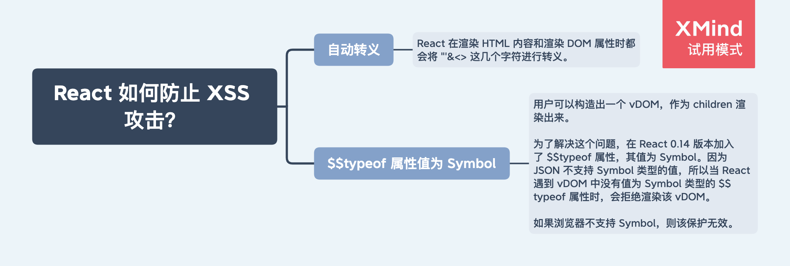

# XSS 攻击

## React 如何防止 XSS 攻击？

## 疑问
为什么 document.body.innerHTML 插入 script 标签，不会执行 script 中的代码？
HTML5 规范规定的。

https://developer.mozilla.org/en-US/docs/Web/API/Element/innerHTML#security_considerations

CSP 是什么？
http://www.ruanyifeng.com/blog/2016/09/csp.html

xss 白名单是什么？
https://github.com/leizongmin/js-xss

## 参考

- https://tech.meituan.com/2018/09/27/fe-security.html
- https://www.zoo.team/article/xss-in-react
- https://overreacted.io/zh-hans/why-do-react-elements-have-typeof-property/
