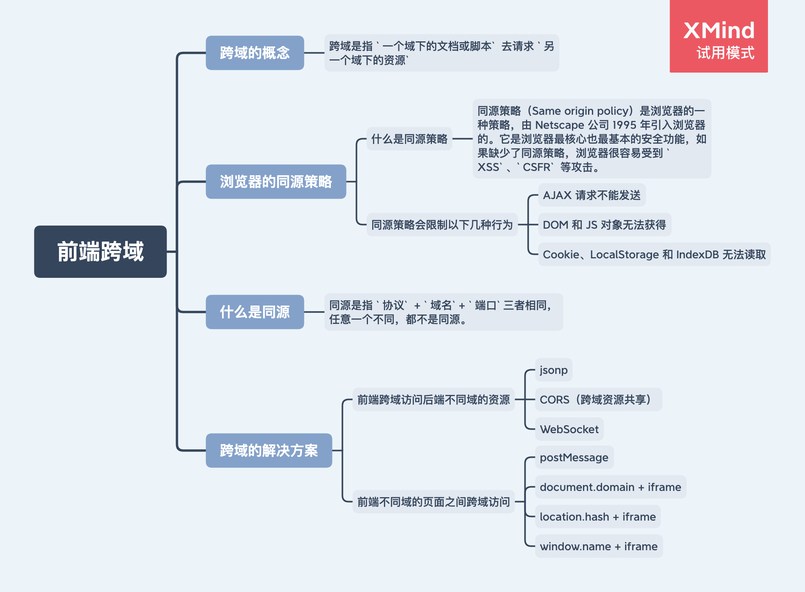

# 前端跨域解决方案


跨域是指 `一个域下的文档或脚本` 去请求 `另一个域下的资源`。

## 1. 浏览器的同源策略

同源策略（Same origin policy）是浏览器的一种策略，由 Netscape 公司 1995 年引入浏览器的。它是浏览器最核心也最基本的安全功能，如果缺少了同源策略，浏览器很容易受到 `XSS`、`CSFR` 等攻击。

同源是指 `协议` + `域名`+ `端口`三者相同，任意一个不同，都不是同源。

同源策略会限制以下几种行为：

1. AJAX 请求不能发送
2. DOM 和 JS 对象无法获得
3. Cookie、LocalStorage 和 IndexDB 无法读取

## 2. 跨域的解决方案

- 前端跨域访问后端不同域的资源

1. jsonp
2. CORS（跨域资源共享）
3. WebSocket

- 前端不同域的页面之间跨域访问

1. postMessage
2. document.domain + iframe
3. location.hash + iframe
4. window.name + iframe

## jsonp 跨域

在 html 中，浏览器允许 script 标签加载其他域的 js 文件（css/img 等其他静态资源也允许）。基于此原理，可以通过动态的创建 script 标签来实现请求后端实现跨域请求。

- 前端代码：

```html
<script>
  var script = document.createElement('script');
  script.type = 'text/javascript';

  // 传参一个回调函数名给后端，方便后端返回时执行这个在前端定义的回调函数
  script.src =
    'http://www.test.com:8080/api/v1/test?user=admin&callback=handleCallback';
  document.head.appendChild(script);

  // 定义回调函数
  function handleCallback(res) {
    alert(JSON.stringify(res));
  }
</script>
```

- 后端代码：

```js
var querystring = require('querystring');
var http = require('http');
var server = http.createServer();

server.on('request', function (req, res) {
  var params = qs.parse(req.url.split('?')[1]);

  // 取到函数名参数：handleCallback
  var fn = params.callback;

  // jsonp 返回设置
  res.writeHead(200, { 'Content-Type': 'text/javascript' });
  // 返回 js 字符串：`handleCallback({ "user": "admin", "callback": "handleCallback" })`
  // 返回 js 字符串后，会立即执行该 js 字符串
  res.write(fn + '(' + JSON.stringify(params) + ')');

  res.end();
});

server.listen('8080');
console.log('Server is running at port 8080...');
```

## CORS 跨域资源共享

后端设置 Access-Control-Allow-Origin 响应头告诉浏览器允许跨域。

如果需要请求带上 cookie，则需要前后端都设置。
前端设置：

```js
xhr.withCredentials = true;
```

后端设置：

```js
// 允许跨域访问的域名：若有端口需写全（协议+域名+端口），若没有端口末尾不用加'/'
response.setHeader('Access-Control-Allow-Origin', 'http://www.domain1.com');

// 允许前端带认证cookie：启用此项后，上面的域名不能为'*'，必须指定具体的域名，否则浏览器会提示
response.setHeader('Access-Control-Allow-Credentials', 'true');

// 提示OPTIONS预检时，后端需要设置的两个常用自定义头
response.setHeader(
  'Access-Control-Allow-Headers',
  'Content-Type,X-Requested-With'
);
```

## WebSocket 协议跨域

WebSocket protocol 是 HTML5 一种新的协议。它实现了浏览器与服务器全双工通信，同时允许跨域通讯。

## postMessage 跨域

postMessage 是 HTML5 XMLHttpRequest Level 2 中的 API，且是为数不多可以跨域操作的 window 属性之一。

postMessage 可以解决以下问题：

1. 页面和其打开的新窗口的数据传递
2. 多窗口之间消息传递
3. 页面与嵌套的 iframe 消息传递
4. 上面三个问题的 `跨域数据传递`

a 页面：http://www.domain1.com/a.html

```html
<iframe
  id="iframe"
  src="http://www.domain2.com/b.html"
  style="display:none;"
></iframe>
<script>
  var iframe = document.getElementById('iframe');
  iframe.onload = function () {
    var data = {
      name: 'test',
    };
    // 向 domain2 传送数据
    iframe.contentWindow.postMessage(
      JSON.stringify(data),
      'http://www.domain2.com'
    );
  };

  // 接受 domain2 返回的数据
  window.addEventListener(
    'message',
    function (e) {
      alert('domain2 data:' + e.data);
    },
    false
  );
</script>
```

b 页面：http://www.domain2.com/b.html

```html
<script>
  // 接收domain1的数据
  window.addEventListener(
    'message',
    function (e) {
      console.log('domain1 data:' + e.data);
      var data = JSON.parse(e.data);
      if (data) {
        data.number = 16;

        // 处理后再发回 domain1
        window.parent.postMessage(
          JSON.stringify(data),
          'http://www.domain1.com'
        );
      }
    },
    false
  );
</script>
```

## document.domain + iframe 跨域

两个页面都通过 js 强制设置 document.domain 为基础主域，就实现了同域。

此方案仅限主域相同，子域不同的跨域应用场景。

父窗口地址：http://www.domain.com

```html
<!-- iframe 中显示子窗口 -->
<iframe id="iframe" src="http://child.domain.com"></iframe>
<script>
  // 设置 document.domain 为一级域名
  document.domain = 'domain.com';
  // 在 window 对象上定义 user 变量
  var user = 'admin';
</script>
```

子窗口地址：http://child.domain.com

```html
<script>
  // 设置 document.domain 为一级域名
  document.domain = 'domain.com';
  // 获取父窗口中的变量
  console.log('window.parent.user:' + window.parent.user);
</script>
```

## location.hash + iframe 跨域

a 与 b 不同域。a 要与 b 跨域通信，可以通过中间页 c 来实现，其中 a 与 c 同域。

三个页面中：

- 不同域之间利用 iframe 的 location.hash 传值（a 与 b，b 与 c）
- 同域名之间直接调用 js 回调来通信

a 页面：http://www.domain1.com/a.html

```html
<!-- 放置隐藏的 b 页面 -->
<iframe
  id="iframe"
  src="http://www.domain2.com/b.html"
  style="display:none;"
></iframe>
<script>
  var iframe = document.getElementById('iframe');

  setTimeout(function () {
    // 改变 iframe src 地址的 hash 值
    iframe.src = iframe.src + '#user=admin';
  }, 1000);

  // 开放给同域 c 页面回调
  function handleCallback(res) {
    alert('res:' + res);
  }
</script>
```

b 页面：http://www.domain2.com/b.html

```html
<!-- iframe 访问与 a 页面域名相同的 c 页面 -->
<iframe
  id="iframe"
  src="http://www.domain1.com/c.html"
  style="display:none;"
></iframe>
<script>
  var iframe = document.getElementById('iframe');

  // 监听 a 页面传来的hash值，传给 c 页面
  window.onhashchange = function () {
    iframe.src = iframe.src + location.hash;
  };
</script>
```

c 页面（与 a 页面同域）：http://www.domain1.com/c.html

```html
<script>
  // 监听 b 页面传来的 hash 值
  window.onhashchange = function () {
    // 直接调用与 c 页面同域的 a 页面中定义好的回调
    window.parent.parent.handleCallback(
      'hello: ' + location.hash.replace('#user=', '')
    );
  };
</script>
```

## window.name + iframe 跨域

利用 window.name 的一个特性：window.name 的值在不同的页面加载后会依旧存在。

a 页面：http://www.domain1.com/a.html

```js
// url:访问的跨域地址
// callback:得到跨域地址返回数据的回调
var proxy = function (url, callback) {
  var state = 0;
  var iframe = document.createElement('iframe');

  // 加载跨域页面
  iframe.src = url;

  // onload事件会触发2次，第 1 次加载跨域页，并留存数据于 window.name
  iframe.onload = function () {
    if (state === 0) {
      // 第 1 次 加载跨域页面成功后，切换到同域代理页面。
      // 此时在跨域页面中已经修改了 iframe 的 window.name 的值，
      iframe.contentWindow.location = 'http://www.domain1.com/proxy.html';
      state = 1;
    } else if (state === 1) {
      // 第 2 次加载同域的 proxy 页面成功后，读取同域 window.name 中数据
      callback(iframe.contentWindow.name);
      destoryFrame();
    }
  };

  document.body.appendChild(iframe);

  // 获取数据以后销毁这个iframe，释放内存
  // 这也保证了安全（不被其他域的 js访问）
  function destoryFrame() {
    iframe.contentWindow.document.write('');
    iframe.contentWindow.close();
    document.body.removeChild(iframe);
  }
};

// 请求跨域b页面数据
proxy('http://www.domain2.com/b.html', function (data) {
  alert(data);
});
```

proxy 页面：http://www.domain1.com/proxy.html

中间代理页面，与 a 页面同域，内容为空即可。

b 页面：http://www.domain2.com/b.html

```html
<script>
  // 在 b 页面修改 window.name 的值
  window.name = 'new name';
</script>
```

## 参考

https://segmentfault.com/a/1190000011145364
