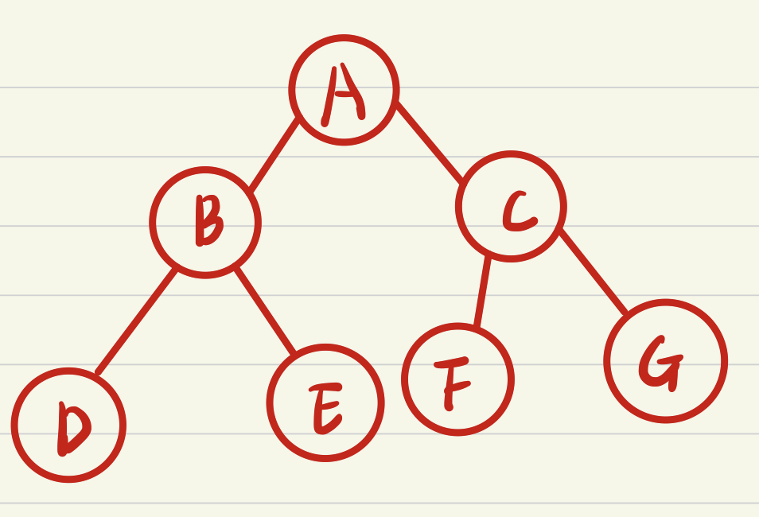

# 后序遍历



- 节点的访问顺序是：左子树 → 右子树 → 根节点
- 上图中，后序遍历的结果为：DEB

## 1. 递归法

```js
const preOrder = (root, callback) => {
  if (root === null) {
    return;
  }
  callback(root); // 访问节点
  preOrder(root.left, callback);
  preOrder(root.right, callback);
};
```

## 2. 迭代法

利用栈来实现。

```js
const preOrder = (root, callback) => {
  const stack = [];
  if (root === null) {
    return;
  }
  stack.push(root);
  while (stack.length) {
    const node = stack.pop();
    callback(node); // 访问节点
    if (node.right !== null) {
      stack.push(node.right);
    }
    if (node.left !== null) {
      stack.push(node.left);
    }
  }
};
```
